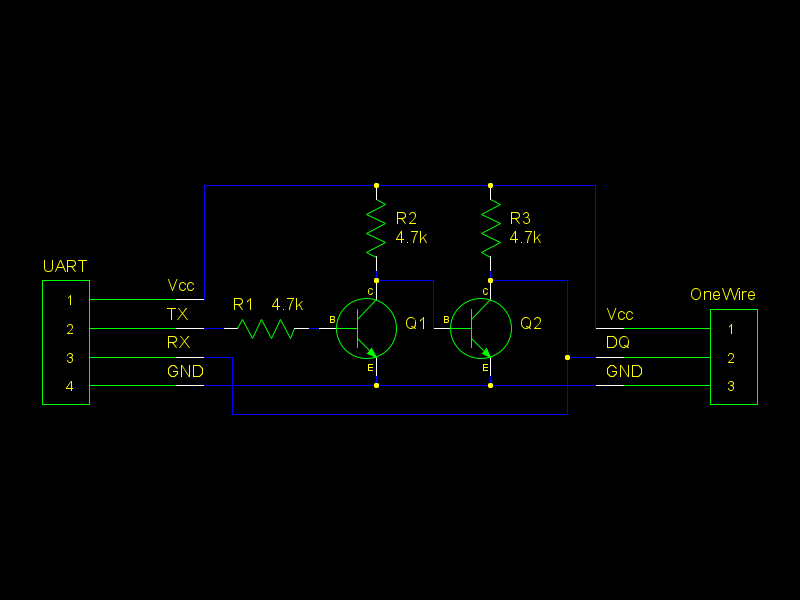

# onewire-over-uart:
## Access Dallas 1-wire bus on your PC with simple and cheap hardware.

This project is based on Maxim's application note:
Using a UART to Implement a 1-Wire Bus Master

[http://www.maximintegrated.com/app-notes/index.mvp/id/214](http://www.maximintegrated.com/app-notes/index.mvp/id/214 "Using a UART to Implement a 1-Wire Bus Master")

Please also see this post from vbranimir: [https://haklabos.wordpress.com/projekti/digitemp/](https://haklabos.wordpress.com/projekti/digitemp/)

## License

 Part of the project are based on other works, most of which does not contain a statement of license. Please contact the authors separately via the email addresses listed in individual files. Other codes are licensed under [WTFPL](http://www.wtfpl.net/).

***
### Hardware

The original version mentioned in Maxim's application note is shown as below.

Also a simplified version is available:

Resistors can vary from 200ohm to 20kohm. Transistors can be BJTs or MOSFETs.
The diode used in the simplified version should be fast and has a low forwarding voltage.
1N4148 is known to work.

A USB to UART converter is needed.
There are many USB to UART converters that have a TTL UART interface.
RS-232 UARTs should be avoided since its voltage is very high and can damage your device.
If you have to use one of such, insert a MAX232 or equivalent chip between the RS-232 port and
the circuits mentioned above properly.

Here are a few models that are tested. Many of these are prices under $5:

* SiLabs CP2102 USB to UART converters (shown below) are known to work.

    

* Prolific PL2303 USB to UART converters (shown below) are also known to work,
    but most boards have problematic power output pins.
    Try to power your 1-wire device separately or strange things will happen.

    

* FTDI FT232L USB to UART converters (shown below) are also known to work,
    but they are more expensive than the former two types.

    

***
### Software

Type `make` to get `lsow` and `digitemp_evil` compiled.
To build for Windows under Linux, try installing `mingw` and then type `make OS=Windows_NT CC=i686-w64-mingw32-gcc-posix`.
Remember to `make clean` before and after switching targets.

lsow is a tool that list devices on a onewire bus connected to a USB to UART converter.
Simply type something like `lsow /dev/ttyUSB0` (or something like `lsow COM0:` under Windows) and it will show device IDs found on the bus.

digitemp\_evil is a demonstration program that reads temperature values from DS18S20/DS18B20/DS1822
onewire digital temperature sensors. Type `digitemp_evil /dev/ttyUSB0` and read IDs and values.
Sometimes after powering up DS18B20 will give something like 85°C, you will just need retry.

